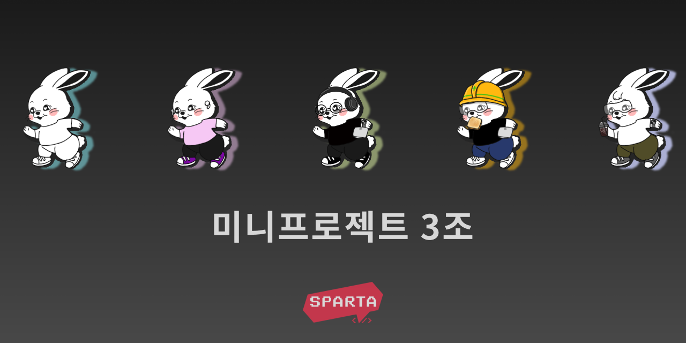

# presenter

## Snapshots

<div markdown="1">
	<p align="center">
		
		
		
		
	</p>
</div>

## Widget Tree

<p>
	
</p>

## Model Image

<p>
	
</p>

## File Structures

```bash
lib
├── configs
│   ├── palette.dart
│   └── 로컬_정보_파일은_이곳에.md
├── main.dart
├── models
│   ├── member.dart
│   └── 모델_클래스_파일은_이곳에.md
├── providers
│   ├── member_provider.dart
│   └── 상태관리_클래스_파일은_이곳에.md
├── screens
│   ├── edit_member_screen.dart
│   ├── member_create.dart
│   ├── member_detail_card_page.dart
│   ├── memberlist.dart
│   ├── team_screen.dart
│   └── 화면을_담당하는_파일은_이곳에.md
├── services
│   └── 네트워킹_클래스_파일은_이곳에.md
└── widgets
    ├── devjeans_image.dart
    ├── devjeans_picker.dart
    ├── member_create_widget.dart
    ├── teamintro_bottom.dart
    └── 화면에_포함되는_재사용_위젯은_이곳에.md
```

## Dependencies

- `dart ^3.0.0`
- `flutter ^3.0.5`
- `shared_preferences ^2.2.0`
- `provider ^6.0.5`
- `url_launcher ^6.1.12`
- `flutter_lints ^2.0.0`

## Git Convention
> 아래 링크를 통해 바로 확인할 수 있어요.

[바로가기](./CONVENTION.md)
